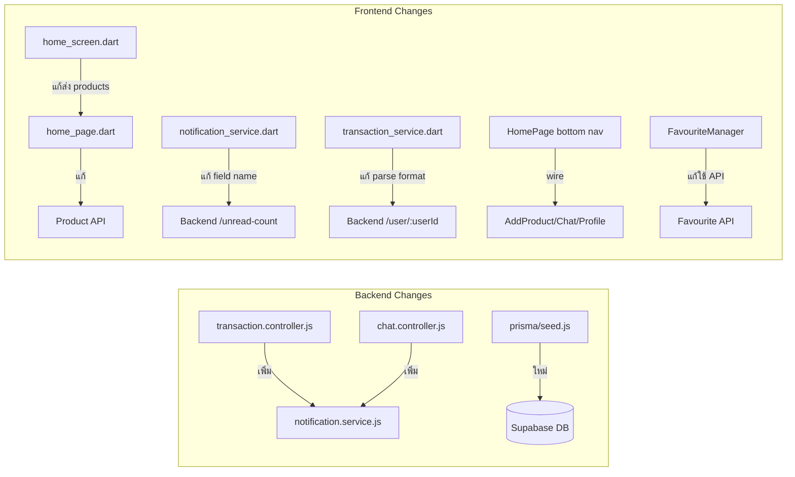

# เอกสารออกแบบ (Design Document) — UniMart Iteration 2 Wiring

## ภาพรวม (Overview)

เอกสารนี้ครอบคลุมงาน wiring/integration ที่เหลือจาก UniMart Iteration 2 เพื่อให้ระบบทำงานได้ end-to-end จริง ประกอบด้วย 4 กลุ่มงาน:

1. **Database Sync & Seed** — sync Prisma schema ไปยัง Supabase และเพิ่มข้อมูลเริ่มต้น (categories, meeting points)
2. **Wire Notification** — เชื่อมต่อ `createNotification` เข้ากับ transaction controller และ chat controller ที่ยังเป็น TODO
3. **แก้ไข Frontend ให้ใช้ข้อมูลจริง** — HomePage ดึงสินค้าจาก API, navigation ใน bottom nav, หน้า Favourited ใช้ API
4. **แก้ไข Bug (Field/Format Mismatch)** — NotificationService อ่าน field ผิด, TransactionService parse format ผิด

### การตัดสินใจออกแบบหลัก

- **ไม่สร้าง API ใหม่** — ทุก endpoint ที่ต้องใช้มีอยู่แล้ว เป็นงาน wiring เท่านั้น
- **Notification fire-and-forget** — การสร้าง notification ใน transaction/chat controller จะไม่ block response หลัก ถ้า notification ล้มเหลวจะ log error แต่ไม่ fail transaction/message
- **HomePage รับ products เป็น parameter** — แทนที่จะให้ HomePage fetch เอง จะให้ HomeScreen ส่ง products ที่ fetch แล้วเข้าไป เพื่อแยก data fetching ออกจาก UI
- **TransactionService return grouped data** — แก้ให้ parse grouped object `{ processing, shipping, history, canceled }` แทน List ตรงๆ
- **Seed script idempotent** — ใช้ `upsert` เพื่อให้รันซ้ำได้โดยไม่ error

## สถาปัตยกรรม (Architecture)

สถาปัตยกรรมไม่เปลี่ยนแปลงจาก Iteration 2 design เดิม เป็นงาน wiring ภายในโครงสร้างที่มีอยู่แล้ว

### แผนภาพการเปลี่ยนแปลง



## คอมโพเนนต์และอินเทอร์เฟซ (Components and Interfaces)

### การเปลี่ยนแปลง Backend

#### 1. transaction.controller.js — เพิ่ม notification calls

ทุก state transition function (confirm, ship, complete, cancel) จะเพิ่ม `notificationService.createNotification()` หลังจาก transaction operation สำเร็จ:

```javascript
// ตัวอย่าง: confirm
const result = await transactionService.confirmTransaction(req.params.id);
// ... error handling ...
res.json(result.transaction);

// เพิ่ม: fire-and-forget notification
try {
  await notificationService.createNotification(
    result.transaction.buyerId,
    'transaction_update',
    'ธุรกรรมถูกยืนยัน',
    'ผู้ขายยืนยันธุรกรรมของคุณแล้ว',
    { transactionId: result.transaction.id }
  );
} catch (err) {
  console.error('Notification Error:', err.message);
}
```

| Action | ผู้รับ notification | Title | Body |
|--------|-------------------|-------|------|
| confirm | Buyer | ธุรกรรมถูกยืนยัน | ผู้ขายยืนยันธุรกรรมของคุณแล้ว |
| ship | Buyer | สินค้าถูกส่งมอบ | ผู้ขายส่งมอบสินค้าแล้ว |
| complete | Seller | ธุรกรรมเสร็จสิ้น | ผู้ซื้อยืนยันรับสินค้าแล้ว |
| cancel (by buyer) | Seller | ธุรกรรมถูกยกเลิก | ผู้ซื้อยกเลิกธุรกรรม |
| cancel (by seller) | Buyer | ธุรกรรมถูกยกเลิก | ผู้ขายยกเลิกธุรกรรม |

#### 2. chat.controller.js — เพิ่ม notification ใน sendMessage

หลังจากส่งข้อความสำเร็จ จะดึง buyer_id/seller_id จาก room แล้วส่ง notification ไปยังอีกฝ่าย:

```javascript
// sendMessage — หลัง chatService.sendMessage สำเร็จ
// room data มาจาก chatService.sendMessage ที่ return room info อยู่แล้ว
const recipientId = room.buyer_id === senderId ? room.seller_id : room.buyer_id;

try {
  await notificationService.createNotification(
    recipientId,
    'chat_message',
    'ข้อความใหม่',
    content ? content.substring(0, 100) : 'ส่งรูปภาพ',
    { roomId }
  );
} catch (err) {
  console.error('Chat Notification Error:', err.message);
}
```

#### 3. prisma/seed.js — สร้างใหม่

```javascript
// Idempotent seed script
// - upsert 8 categories
// - upsert 5 meeting points
```

### การเปลี่ยนแปลง Frontend

#### 4. notification_service.dart — แก้ field name

```dart
// ก่อน (bug):
return data['count'] ?? 0;

// หลัง (fix):
return data['unreadCount'] ?? 0;
```

#### 5. transaction_service.dart — แก้ parse format

```dart
// ก่อน (bug): พยายาม parse เป็น List
final List data = jsonDecode(response.body);
return data.map((e) => Transaction.fromJson(e)).toList();

// หลัง (fix): parse เป็น grouped object
final Map<String, dynamic> grouped = jsonDecode(response.body);
return {
  'processing': (grouped['processing'] as List).map((e) => Transaction.fromJson(e)).toList(),
  'shipping': (grouped['shipping'] as List).map((e) => Transaction.fromJson(e)).toList(),
  'history': (grouped['history'] as List).map((e) => Transaction.fromJson(e)).toList(),
  'canceled': (grouped['canceled'] as List).map((e) => Transaction.fromJson(e)).toList(),
};
```

#### 6. home_page.dart + home_screen.dart — ใช้ข้อมูลจริง

- `HomeScreen` fetch products จาก API (มี `_fetchProducts()` อยู่แล้ว)
- ส่ง `products` list เข้า `HomePage` เป็น constructor parameter
- `HomePage` ใช้ `List<Product>` แทน `kAllProducts`
- เพิ่ม loading state และ error state

#### 7. HomePage bottom nav — wire navigation

| ปุ่ม | ปัจจุบัน | แก้เป็น |
|------|---------|--------|
| Sell | ไม่ทำอะไร | `Navigator.push` → `AddProductScreen` |
| Chat | ไม่ทำอะไร | `Navigator.push` → `ChatListScreen` |
| Profile | ไม่ทำอะไร | `Navigator.push` → หน้า Profile/Transaction |

#### 8. FavouriteManager + FavouritedPage — ใช้ข้อมูลจริง

- `FavouriteManager.favouritedProducts` ปัจจุบัน filter จาก `kAllProducts` (hardcoded)
- แก้ให้ดึงข้อมูลสินค้าจริงจาก API โดยใช้ product IDs ที่อยู่ใน `_myFavourites`
- `FavouritedPage` จะแสดง `Product` (จาก API) แทน `ProductItem` (hardcoded)

## แบบจำลองข้อมูล (Data Models)

### ไม่มีการเปลี่ยนแปลง Schema

Prisma schema มีตาราง Transaction, Review, MeetingPoint, Category ครบแล้ว เป็นเพียงการ sync ไปยัง Supabase ด้วย `prisma db push`

### Seed Data

#### Categories (8 รายการ)

| id | name |
|----|------|
| 1 | Textbooks |
| 2 | Uniforms |
| 3 | Gadgets |
| 4 | Accessories |
| 5 | Stationery |
| 6 | Dorm Essentials |
| 7 | Sports |
| 8 | Others |

#### Meeting Points (5 รายการ)

| id | name | zone |
|----|------|------|
| 1 | โรงอาหารกรีน | ในมหาวิทยาลัย |
| 2 | SC Hall | ในมหาวิทยาลัย |
| 3 | ป้ายรถตู้ | ในมหาวิทยาลัย |
| 4 | หอพักเชียงราก | เชียงราก |
| 5 | หอพักอินเตอร์โซน | อินเตอร์โซน |

## คุณสมบัติความถูกต้อง (Correctness Properties)

*คุณสมบัติ (Property) คือลักษณะหรือพฤติกรรมที่ควรเป็นจริงในทุกการทำงานที่ถูกต้องของระบบ — เป็นข้อกำหนดเชิงรูปนัยเกี่ยวกับสิ่งที่ระบบควรทำ Properties ทำหน้าที่เป็นสะพานเชื่อมระหว่าง specification ที่มนุษย์อ่านได้กับการรับประกันความถูกต้องที่เครื่องตรวจสอบได้*

### Property 1: Seed Script Idempotent

*For any* จำนวนครั้งที่รัน seed script (1 ครั้ง, 2 ครั้ง, หรือ N ครั้ง) จำนวน categories ในตาราง Category ต้องเท่ากับ 8 เสมอ และจำนวน meeting points ในตาราง meeting_points ต้องเท่ากับ 5 เสมอ (ไม่มีข้อมูลซ้ำ)

**Validates: Requirements 2.2, 3.2**

### Property 2: Transaction State Transition สร้าง Notification

*For any* transaction state transition ที่สำเร็จ (confirm, ship, complete, cancel) ระบบต้องสร้าง notification record ใหม่ 1 รายการ โดย notification.user_id ต้องเป็นอีกฝ่ายที่ไม่ใช่ผู้กระทำ (confirm/ship → buyer, complete → seller, cancel → อีกฝ่าย) และ notification.type ต้องเป็น "transaction_update"

**Validates: Requirements 4.1, 4.2, 4.3, 4.4**

### Property 3: Notification Failure ไม่ทำให้ Operation หลักล้มเหลว

*For any* transaction operation หรือ chat message ที่ trigger notification ถ้า notification service throw error, response ของ operation หลักต้องยังคงสำเร็จ (HTTP 2xx) และข้อมูล transaction/message ต้องถูกบันทึกในฐานข้อมูลถูกต้อง

**Validates: Requirements 4.5, 5.3**

### Property 4: Chat Message สร้าง Notification ไปยังผู้รับที่ถูกต้อง

*For any* ข้อความที่ส่งสำเร็จใน chat room ระบบต้องสร้าง notification 1 รายการ โดย notification.user_id ต้องเป็นฝ่ายที่ไม่ใช่ผู้ส่ง (ถ้า sender == buyer_id → notify seller_id, ถ้า sender == seller_id → notify buyer_id) และ notification.type ต้องเป็น "chat_message"

**Validates: Requirements 5.1, 5.2**

### Property 5: HomePage กรองสินค้าของตัวเองออก

*For any* รายการสินค้าที่แสดงบน HomePage ทุก product ในรายการต้องมี ownerId ≠ currentUserId (ไม่แสดงสินค้าของตัวเอง)

**Validates: Requirements 6.5**

### Property 6: Unread Count Round-Trip

*For any* ค่า unread count ที่ backend ส่งกลับมาในรูปแบบ `{ "unreadCount": N }` Flutter NotificationService.getUnreadCount ต้อง return ค่า N ที่ตรงกัน

**Validates: Requirements 8.1, 8.2**

### Property 7: Transaction Grouped Response Parse ถูกต้อง

*For any* grouped transaction response จาก backend ที่มีรูปแบบ `{ processing: [...], shipping: [...], history: [...], canceled: [...] }` Flutter TransactionService ต้อง parse ได้ถูกต้อง โดยจำนวน transactions ในแต่ละกลุ่มต้องตรงกับ backend response

**Validates: Requirements 9.1**

### Property 8: Favourite Toggle Round-Trip

*For any* product ที่ผู้ใช้กด toggle favourite สถานะ favourite ใน product_favourites table ต้องตรงกับ local state (ถ้า toggle เป็น liked → มี row ใน table, ถ้า toggle เป็น unliked → ไม่มี row)

**Validates: Requirements 10.2**

## การจัดการข้อผิดพลาด (Error Handling)

| สถานการณ์ | การจัดการ |
|-----------|----------|
| Notification service ล้มเหลวใน transaction controller | Log error, return transaction response สำเร็จตามปกติ |
| Notification service ล้มเหลวใน chat controller | Log error, return message response สำเร็จตามปกติ |
| `prisma db push` ล้มเหลว | แสดง error message จาก Prisma, นักพัฒนาต้องแก้ไข schema/connection |
| Seed script ล้มเหลว (DB connection) | Throw error พร้อม message ที่ชัดเจน |
| HomePage API call ล้มเหลว | แสดง error message + ปุ่ม retry |
| TransactionService ได้ response format ผิด | Return error message แทนการ crash |
| NotificationService ได้ response ที่ไม่มี field unreadCount | Return 0 (default) |
| FavouriteManager sync ไป Supabase ล้มเหลว | Rollback local state, แสดง error |

## กลยุทธ์การทดสอบ (Testing Strategy)

### แนวทางการทดสอบแบบคู่ (Dual Testing Approach)

- **Unit Tests**: ทดสอบ specific examples และ edge cases
- **Property-Based Tests**: ทดสอบ properties ที่ต้องเป็นจริงสำหรับทุก input

### Property-Based Testing Configuration

- **Library**: [fast-check](https://github.com/dubzzz/fast-check) สำหรับ Node.js backend
- **Iterations**: ขั้นต่ำ 100 iterations ต่อ property test
- **Tag Format**: `Feature: unimart-iteration-2-wiring, Property {number}: {property_text}`
- **แต่ละ correctness property ต้องถูก implement ด้วย property-based test เดียว**

### Unit Tests

1. **Seed Script**:
   - รัน seed → ตรวจสอบว่ามี 8 categories และ 5 meeting points (Req 2.1, 3.1)
   - รัน seed ซ้ำ → ไม่มี error และจำนวนไม่เพิ่ม

2. **Transaction Notification Wiring**:
   - confirm → ตรวจสอบว่า notification ถูกสร้างสำหรับ buyer
   - cancel by buyer → ตรวจสอบว่า notification ถูกสร้างสำหรับ seller

3. **Chat Notification Wiring**:
   - ส่งข้อความ → ตรวจสอบว่า notification ถูกสร้างสำหรับผู้รับ

4. **Frontend Bug Fixes**:
   - NotificationService.getUnreadCount อ่าน `unreadCount` field ถูกต้อง
   - TransactionService parse grouped object ถูกต้อง
   - TransactionService handle invalid response format โดยไม่ crash

### Property-Based Tests

แต่ละ property จาก Correctness Properties section จะถูก implement เป็น fast-check test:

```javascript
// ตัวอย่าง: Property 2 - Transaction State Transition สร้าง Notification
// Feature: unimart-iteration-2-wiring, Property 2: Transaction State Transition สร้าง Notification
test('every transaction state transition creates a notification', () => {
  fc.assert(
    fc.property(
      fc.constantFrom('confirm', 'ship', 'complete', 'cancel'),
      fc.uuid(),  // buyerId
      fc.uuid(),  // sellerId
      async (action, buyerId, sellerId) => {
        // setup transaction, perform action, verify notification created
      }
    ),
    { numRuns: 100 }
  );
});
```

