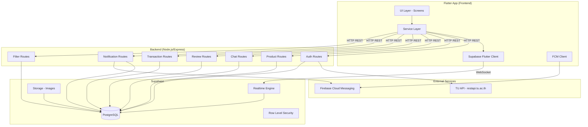
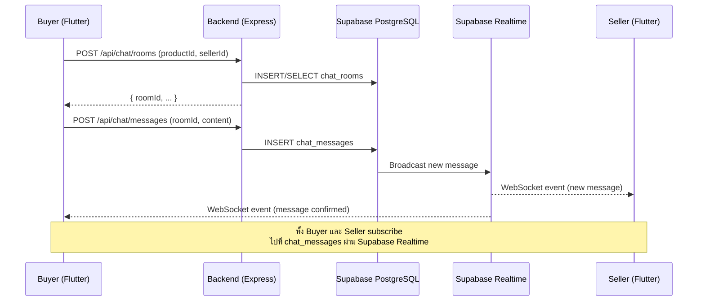
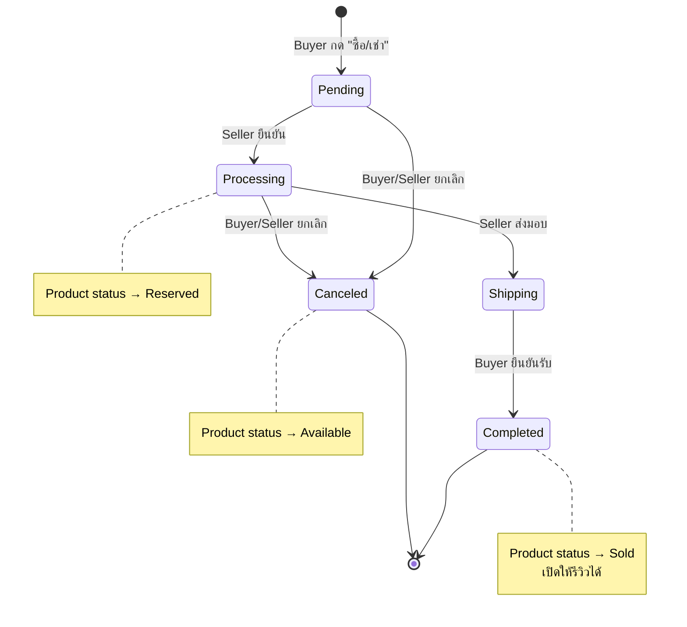
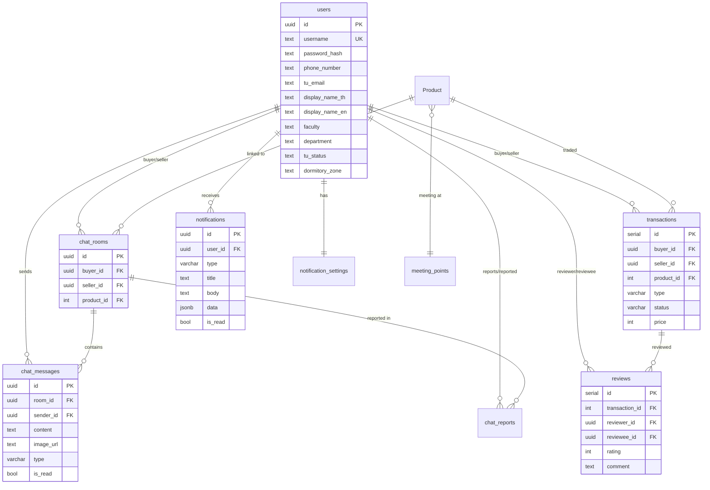

# เอกสารออกแบบ (Design Document) — UniMart Iteration 2

## ภาพรวม (Overview)

UniMart Iteration 2 เป็นการพัฒนาต่อยอดจากระบบตลาดซื้อขายแบบ Closed-Loop สำหรับนักศึกษามหาวิทยาลัยธรรมศาสตร์ โดยเพิ่ม 6 ฟีเจอร์หลัก:

1. **ระบบแชทในแอป (In-App Chat)** — สื่อสารระหว่างผู้ซื้อ/ผู้ขายแบบ Real-time ผ่าน Supabase Realtime
2. **ระบบรีวิวและเครดิต (Review/Credit)** — ให้คะแนนดาวและรีวิวหลังทำธุรกรรมเสร็จ
3. **ระบบกรองอัจฉริยะ (Smart Filter)** — กรองสินค้าตามคณะ, โซนหอพัก, จุดนัดพบ
4. **การยืนยันตัวตน TU (Enhanced Auth)** — ยืนยันผ่าน TU API พร้อมรหัสผ่าน UniMart แยกต่างหาก
5. **ระบบแจ้งเตือน (Notifications)** — Push notification สำหรับแชทและธุรกรรม
6. **ระบบธุรกรรม (Transaction Management)** — วงจรชีวิตธุรกรรม Pending → Processing → Shipping → Completed/Canceled

### การตัดสินใจออกแบบหลัก (Key Design Decisions)

- **Supabase Realtime** สำหรับแชทและแจ้งเตือนแบบ Real-time แทนการสร้าง WebSocket server เอง เพราะ Supabase มีอยู่แล้วในระบบและรองรับ Row Level Security (RLS)
- **Prisma ORM** ยังคงใช้สำหรับ Product, Category, Transaction, Review เพราะเป็น pattern ที่ทีมคุ้นเคย
- **Supabase Client (Direct)** สำหรับ Chat tables เพื่อใช้ Realtime subscriptions ได้โดยตรงจาก Flutter
- **bcrypt** สำหรับ hash รหัสผ่าน UniMart (ไม่เก็บรหัสผ่าน TU)
- **Firebase Cloud Messaging (FCM)** สำหรับ Push Notification เมื่อแอปอยู่ background

## สถาปัตยกรรม (Architecture)

### สถาปัตยกรรมระดับสูง (High-Level Architecture)



### Data Flow: ระบบแชท (Chat Flow)



### Data Flow: ธุรกรรม (Transaction Flow)



## คอมโพเนนต์และอินเทอร์เฟซ (Components and Interfaces)

### Backend API Endpoints

#### 1. Authentication (ปรับปรุง)

| Method | Endpoint | คำอธิบาย |
|--------|----------|----------|
| POST | `/api/auth/verify` | ยืนยันตัวตนผ่าน TU API (ปรับปรุง) |
| POST | `/api/auth/register` | ลงทะเบียนพร้อมรหัสผ่าน UniMart (ปรับปรุง) |
| POST | `/api/auth/login` | เข้าสู่ระบบด้วย username + รหัสผ่าน UniMart (ใหม่) |

**POST /api/auth/verify** — ยืนยันตัวตนผ่าน TU API
```
Request:  { "username": "6xxxxxxxxx", "password": "<reg.tu.ac.th password>" }
Response: { "success": true, "action": "GO_TO_REGISTER", "tuProfile": { ... } }
       or { "success": true, "action": "LOGIN_EXISTS", "message": "..." }
       or { "success": false, "message": "รหัสนักศึกษาหรือรหัสผ่านไม่ถูกต้อง..." }
```

**POST /api/auth/register** — ลงทะเบียนพร้อมตั้งรหัสผ่าน UniMart
```
Request:  { "username": "6xxx", "phone_number": "08x", "app_password": "xxx", ...tuProfile }
Response: { "success": true, "user": { ... } }
```

**POST /api/auth/login** — เข้าสู่ระบบด้วยรหัสผ่าน UniMart
```
Request:  { "username": "6xxxxxxxxx", "password": "<unimart password>" }
Response: { "success": true, "user": { ... }, "token": "..." }
       or { "success": false, "message": "..." }
```

#### 2. Chat

| Method | Endpoint | คำอธิบาย |
|--------|----------|----------|
| POST | `/api/chat/rooms` | สร้างหรือเปิด Chat Room |
| GET | `/api/chat/rooms/:userId` | ดึงรายการ Chat Room ของผู้ใช้ |
| GET | `/api/chat/rooms/:roomId/messages` | ดึงข้อความใน Chat Room |
| POST | `/api/chat/messages` | ส่งข้อความ (text/image) |
| POST | `/api/chat/reports` | รายงานผู้ใช้ |

**POST /api/chat/rooms**
```
Request:  { "buyerId": "uuid", "sellerId": "uuid", "productId": 123 }
Response: { "id": "uuid", "buyerId": "...", "sellerId": "...", "productId": 123, "createdAt": "..." }
```

**GET /api/chat/rooms/:userId**
```
Response: [
  {
    "id": "uuid",
    "productTitle": "...",
    "otherUser": { "displayName": "...", "username": "..." },
    "lastMessage": { "content": "...", "createdAt": "...", "type": "text" },
    "unreadCount": 3
  }
]
```

**POST /api/chat/messages**
```
Request:  { "roomId": "uuid", "senderId": "uuid", "content": "สวัสดีครับ", "type": "text" }
       or { "roomId": "uuid", "senderId": "uuid", "imageUrl": "...", "type": "image" }
Response: { "id": "uuid", "roomId": "...", "senderId": "...", "content": "...", "type": "text", "createdAt": "..." }
```

#### 3. Reviews

| Method | Endpoint | คำอธิบาย |
|--------|----------|----------|
| POST | `/api/reviews` | สร้างรีวิว |
| GET | `/api/reviews/user/:userId` | ดึงรีวิวของผู้ใช้ |
| GET | `/api/reviews/credit/:userId` | ดึง Credit Score |

**POST /api/reviews**
```
Request:  { "transactionId": 123, "reviewerId": "uuid", "revieweeId": "uuid", "rating": 5, "comment": "ดีมาก" }
Response: { "id": 1, "rating": 5, "comment": "ดีมาก", "createdAt": "..." }
       or { "success": false, "message": "คุณได้รีวิวธุรกรรมนี้แล้ว" }
```

#### 4. Smart Filter

| Method | Endpoint | คำอธิบาย |
|--------|----------|----------|
| GET | `/api/products/filter` | กรองสินค้าตามเงื่อนไข |
| GET | `/api/meeting-points` | ดึงรายการจุดนัดพบ |
| GET | `/api/dormitory-zones` | ดึงรายการโซนหอพัก |

**GET /api/products/filter**
```
Query: ?faculty=วิศวกรรมศาสตร์&dormitoryZone=เชียงราก&meetingPoint=SC Hall&minCredit=3.5&categoryId=1
Response: { "products": [...], "totalCount": 42 }
```

#### 5. Transactions

| Method | Endpoint | คำอธิบาย |
|--------|----------|----------|
| POST | `/api/transactions` | สร้างธุรกรรม |
| PATCH | `/api/transactions/:id/confirm` | Seller ยืนยัน (→ Processing) |
| PATCH | `/api/transactions/:id/ship` | Seller ส่งมอบ (→ Shipping) |
| PATCH | `/api/transactions/:id/complete` | Buyer ยืนยันรับ (→ Completed) |
| PATCH | `/api/transactions/:id/cancel` | ยกเลิก (→ Canceled) |
| GET | `/api/transactions/user/:userId` | ดึงรายการธุรกรรมของผู้ใช้ |

**POST /api/transactions**
```
Request:  { "buyerId": "uuid", "productId": 123, "type": "SALE" }
Response: { "id": 1, "status": "PENDING", "productId": 123, ... }
       or { "success": false, "message": "สินค้านี้ถูกจองแล้ว" }
```

#### 6. Notifications

| Method | Endpoint | คำอธิบาย |
|--------|----------|----------|
| GET | `/api/notifications/:userId` | ดึงรายการแจ้งเตือน |
| PATCH | `/api/notifications/:id/read` | อ่านแจ้งเตือน |
| GET | `/api/notifications/:userId/unread-count` | จำนวนแจ้งเตือนที่ยังไม่อ่าน |
| PATCH | `/api/notifications/:userId/settings` | ตั้งค่าการแจ้งเตือน |


### Frontend Components (Flutter)

#### ใหม่ — Screens

| Screen | คำอธิบาย |
|--------|----------|
| `ChatListScreen` | รายการ Chat Room ทั้งหมดของผู้ใช้ |
| `ChatRoomScreen` | หน้าสนทนาใน Chat Room พร้อม Realtime |
| `ReviewScreen` | หน้าเขียนรีวิว (คะแนนดาว + ข้อความ) |
| `UserProfileScreen` | โปรไฟล์ผู้ใช้คนอื่น (Credit Score, รีวิว) |
| `TransactionListScreen` | รายการธุรกรรมแยกตามสถานะ |
| `TransactionDetailScreen` | รายละเอียดธุรกรรมพร้อมปุ่มเปลี่ยนสถานะ |
| `NotificationScreen` | รายการแจ้งเตือนทั้งหมด |
| `FilterSheet` | Bottom Sheet สำหรับ Smart Filter |

#### ใหม่ — Services

| Service | คำอธิบาย |
|---------|----------|
| `ChatService` | จัดการ Chat API + Supabase Realtime subscription |
| `ReviewService` | จัดการ Review/Credit API |
| `TransactionService` | จัดการ Transaction API |
| `NotificationService` | จัดการ Notification API + FCM |
| `FilterService` | จัดการ Smart Filter API |
| `AuthService` | ปรับปรุง — เพิ่ม login ด้วยรหัสผ่าน UniMart |

#### ใหม่ — Models

| Model | คำอธิบาย |
|-------|----------|
| `ChatRoom` | ข้อมูล Chat Room |
| `ChatMessage` | ข้อมูลข้อความ |
| `Review` | ข้อมูลรีวิว |
| `Transaction` | ข้อมูลธุรกรรม |
| `Notification` | ข้อมูลแจ้งเตือน |

## แบบจำลองข้อมูล (Data Models)

### ตารางใหม่ที่ต้องเพิ่ม

#### 1. chat_rooms — ห้องสนทนา

```sql
CREATE TABLE chat_rooms (
  id UUID PRIMARY KEY DEFAULT gen_random_uuid(),
  buyer_id UUID NOT NULL REFERENCES users(id),
  seller_id UUID NOT NULL REFERENCES users(id),
  product_id INTEGER NOT NULL REFERENCES "Product"(id),
  created_at TIMESTAMPTZ DEFAULT NOW(),
  updated_at TIMESTAMPTZ DEFAULT NOW(),
  UNIQUE(buyer_id, seller_id, product_id)
);

CREATE INDEX idx_chat_rooms_buyer ON chat_rooms(buyer_id);
CREATE INDEX idx_chat_rooms_seller ON chat_rooms(seller_id);
```

#### 2. chat_messages — ข้อความ

```sql
CREATE TABLE chat_messages (
  id UUID PRIMARY KEY DEFAULT gen_random_uuid(),
  room_id UUID NOT NULL REFERENCES chat_rooms(id) ON DELETE CASCADE,
  sender_id UUID NOT NULL REFERENCES users(id),
  content TEXT,
  image_url TEXT,
  type VARCHAR(10) NOT NULL DEFAULT 'text' CHECK (type IN ('text', 'image')),
  is_read BOOLEAN DEFAULT FALSE,
  created_at TIMESTAMPTZ DEFAULT NOW()
);

CREATE INDEX idx_chat_messages_room ON chat_messages(room_id, created_at);
CREATE INDEX idx_chat_messages_unread ON chat_messages(room_id, is_read) WHERE is_read = FALSE;
```

#### 3. chat_reports — รายงานผู้ใช้

```sql
CREATE TABLE chat_reports (
  id UUID PRIMARY KEY DEFAULT gen_random_uuid(),
  room_id UUID NOT NULL REFERENCES chat_rooms(id),
  reporter_id UUID NOT NULL REFERENCES users(id),
  reported_user_id UUID NOT NULL REFERENCES users(id),
  reason TEXT NOT NULL,
  status VARCHAR(20) DEFAULT 'pending' CHECK (status IN ('pending', 'reviewed', 'resolved')),
  created_at TIMESTAMPTZ DEFAULT NOW()
);
```

#### 4. transactions — ธุรกรรม

```sql
CREATE TABLE transactions (
  id SERIAL PRIMARY KEY,
  buyer_id UUID NOT NULL REFERENCES users(id),
  seller_id UUID NOT NULL REFERENCES users(id),
  product_id INTEGER NOT NULL REFERENCES "Product"(id),
  type VARCHAR(10) NOT NULL CHECK (type IN ('SALE', 'RENT')),
  status VARCHAR(20) NOT NULL DEFAULT 'PENDING'
    CHECK (status IN ('PENDING', 'PROCESSING', 'SHIPPING', 'COMPLETED', 'CANCELED')),
  price INTEGER NOT NULL,
  meeting_point TEXT,
  canceled_by UUID REFERENCES users(id),
  cancel_reason TEXT,
  created_at TIMESTAMPTZ DEFAULT NOW(),
  updated_at TIMESTAMPTZ DEFAULT NOW()
);

CREATE INDEX idx_transactions_buyer ON transactions(buyer_id);
CREATE INDEX idx_transactions_seller ON transactions(seller_id);
CREATE INDEX idx_transactions_product ON transactions(product_id);
CREATE INDEX idx_transactions_status ON transactions(status);
```

#### 5. reviews — รีวิว

```sql
CREATE TABLE reviews (
  id SERIAL PRIMARY KEY,
  transaction_id INTEGER NOT NULL REFERENCES transactions(id),
  reviewer_id UUID NOT NULL REFERENCES users(id),
  reviewee_id UUID NOT NULL REFERENCES users(id),
  rating INTEGER NOT NULL CHECK (rating >= 1 AND rating <= 5),
  comment TEXT,
  created_at TIMESTAMPTZ DEFAULT NOW(),
  UNIQUE(transaction_id, reviewer_id)
);

CREATE INDEX idx_reviews_reviewee ON reviews(reviewee_id);
CREATE INDEX idx_reviews_transaction ON reviews(transaction_id);
```

#### 6. notifications — แจ้งเตือน

```sql
CREATE TABLE notifications (
  id UUID PRIMARY KEY DEFAULT gen_random_uuid(),
  user_id UUID NOT NULL REFERENCES users(id),
  type VARCHAR(30) NOT NULL CHECK (type IN ('chat_message', 'transaction_update', 'review_received')),
  title TEXT NOT NULL,
  body TEXT NOT NULL,
  data JSONB DEFAULT '{}',
  is_read BOOLEAN DEFAULT FALSE,
  created_at TIMESTAMPTZ DEFAULT NOW()
);

CREATE INDEX idx_notifications_user ON notifications(user_id, created_at DESC);
CREATE INDEX idx_notifications_unread ON notifications(user_id, is_read) WHERE is_read = FALSE;
```

#### 7. notification_settings — ตั้งค่าแจ้งเตือน

```sql
CREATE TABLE notification_settings (
  id UUID PRIMARY KEY DEFAULT gen_random_uuid(),
  user_id UUID NOT NULL REFERENCES users(id) UNIQUE,
  push_enabled BOOLEAN DEFAULT TRUE,
  chat_notifications BOOLEAN DEFAULT TRUE,
  transaction_notifications BOOLEAN DEFAULT TRUE,
  fcm_token TEXT,
  updated_at TIMESTAMPTZ DEFAULT NOW()
);
```

#### 8. meeting_points — จุดนัดพบ (Reference Data)

```sql
CREATE TABLE meeting_points (
  id SERIAL PRIMARY KEY,
  name TEXT NOT NULL UNIQUE,
  zone TEXT
);

-- Seed data
INSERT INTO meeting_points (name, zone) VALUES
  ('โรงอาหารกรีน', 'ในมหาวิทยาลัย'),
  ('SC Hall', 'ในมหาวิทยาลัย'),
  ('ป้ายรถตู้', 'ในมหาวิทยาลัย'),
  ('หอพักเชียงราก', 'เชียงราก'),
  ('หอพักอินเตอร์โซน', 'อินเตอร์โซน');
```

### การเปลี่ยนแปลงตารางที่มีอยู่

#### users — เพิ่มฟิลด์

```sql
ALTER TABLE users
  ADD COLUMN password_hash TEXT,          -- รหัสผ่าน UniMart (bcrypt)
  ADD COLUMN tu_status TEXT,              -- สถานะจาก TU API (ปกติ, พักการศึกษา, etc.)
  ADD COLUMN dormitory_zone TEXT;         -- โซนหอพัก (เชียงราก, อินเตอร์โซน, ในมหาวิทยาลัย)
```

#### Product — เพิ่มฟิลด์

```sql
ALTER TABLE "Product"
  ADD COLUMN meeting_point_id INTEGER REFERENCES meeting_points(id);
```

### Prisma Schema Updates

```prisma
// เพิ่มใน schema.prisma

model Transaction {
  id          Int       @id @default(autoincrement())
  buyerId     String    @db.Uuid
  sellerId    String    @db.Uuid
  productId   Int
  type        String    // SALE, RENT
  status      String    @default("PENDING") // PENDING, PROCESSING, SHIPPING, COMPLETED, CANCELED
  price       Int
  meetingPoint String?
  canceledBy  String?   @db.Uuid
  cancelReason String?
  createdAt   DateTime  @default(now())
  updatedAt   DateTime  @updatedAt

  buyer    users    @relation("BuyerTransactions", fields: [buyerId], references: [id])
  seller   users    @relation("SellerTransactions", fields: [sellerId], references: [id])
  product  Product  @relation(fields: [productId], references: [id])
  reviews  Review[]

  @@index([buyerId])
  @@index([sellerId])
  @@index([productId])
  @@index([status])
}

model Review {
  id            Int       @id @default(autoincrement())
  transactionId Int
  reviewerId    String    @db.Uuid
  revieweeId    String    @db.Uuid
  rating        Int       // 1-5
  comment       String?
  createdAt     DateTime  @default(now())

  transaction Transaction @relation(fields: [transactionId], references: [id])
  reviewer    users       @relation("ReviewsGiven", fields: [reviewerId], references: [id])
  reviewee    users       @relation("ReviewsReceived", fields: [revieweeId], references: [id])

  @@unique([transactionId, reviewerId])
  @@index([revieweeId])
}

model MeetingPoint {
  id       Int       @id @default(autoincrement())
  name     String    @unique
  zone     String?
  products Product[] @relation("ProductMeetingPoint")

  @@map("meeting_points")
}

// อัปเดต users model
// เพิ่ม relations:
//   buyerTransactions  Transaction[] @relation("BuyerTransactions")
//   sellerTransactions Transaction[] @relation("SellerTransactions")
//   reviewsGiven       Review[]      @relation("ReviewsGiven")
//   reviewsReceived    Review[]      @relation("ReviewsReceived")
//   passwordHash       String?       @map("password_hash")
//   tuStatus           String?       @map("tu_status")
//   dormitoryZone      String?       @map("dormitory_zone")

// อัปเดต Product model
// เพิ่ม:
//   meetingPointId  Int?
//   meetingPoint    MeetingPoint? @relation("ProductMeetingPoint", fields: [meetingPointId], references: [id])
//   transactions    Transaction[]
```

### Entity Relationship Diagram




## คุณสมบัติความถูกต้อง (Correctness Properties)

*คุณสมบัติ (Property) คือลักษณะหรือพฤติกรรมที่ควรเป็นจริงในทุกการทำงานที่ถูกต้องของระบบ — เป็นข้อกำหนดเชิงรูปนัยเกี่ยวกับสิ่งที่ระบบควรทำ Properties ทำหน้าที่เป็นสะพานเชื่อมระหว่าง specification ที่มนุษย์อ่านได้กับการรับประกันความถูกต้องที่เครื่องตรวจสอบได้*

### Property 1: Chat Room สร้างแบบ Idempotent

*For any* buyer, seller, และ product combination การเรียก create chat room สองครั้งด้วยข้อมูลเดียวกัน ควรได้ room ID เดียวกันกลับมา (ไม่สร้างซ้ำ)

**Validates: Requirements 1.1**

### Property 2: ข้อความเรียงตามลำดับเวลา

*For any* chat room ที่มีข้อความหลายรายการ การดึงข้อความทั้งหมดควรได้ผลลัพธ์ที่เรียงตาม createdAt จากเก่าไปใหม่ (ascending)

**Validates: Requirements 1.3**

### Property 3: ข้อความ Round-Trip (Persistence)

*For any* ข้อความที่ส่งเข้า chat room การดึงข้อความจาก room เดียวกันควรได้ข้อความนั้นกลับมาพร้อมเนื้อหาที่ตรงกัน

**Validates: Requirements 1.6**

### Property 4: Chat List แสดงข้อมูลครบถ้วน

*For any* ผู้ใช้ที่มี chat rooms การดึงรายการ chat rooms ควรได้ผลลัพธ์ที่ทุก room มีข้อมูลครบ: ชื่อคู่สนทนา, ข้อความล่าสุด, เวลา, และจำนวนข้อความที่ยังไม่ได้อ่าน

**Validates: Requirements 1.4**

### Property 5: Report มีข้อมูลครบถ้วน

*For any* report ที่สร้างขึ้น ข้อมูลที่บันทึกควรประกอบด้วย room_id, reporter_id, reported_user_id, reason, และ created_at ครบทุกฟิลด์

**Validates: Requirements 1.7**

### Property 6: รีวิวได้เฉพาะธุรกรรมที่เสร็จสิ้น

*For any* transaction ที่มีสถานะ COMPLETED ทั้ง buyer และ seller ควรสามารถสร้าง review ได้ และ *for any* transaction ที่มีสถานะอื่น (PENDING, PROCESSING, SHIPPING, CANCELED) การสร้าง review ควรถูกปฏิเสธ

**Validates: Requirements 2.1, 2.2**

### Property 7: Credit Score เท่ากับค่าเฉลี่ยคะแนนดาว

*For any* ผู้ใช้ที่มี reviews ค่า Credit Score ที่คำนวณได้ควรเท่ากับค่าเฉลี่ย (mean) ของคะแนน rating ทั้งหมดที่ผู้ใช้ได้รับ

**Validates: Requirements 2.3**

### Property 8: โปรไฟล์แสดงข้อมูลรีวิวครบถ้วน

*For any* ผู้ใช้ การดึงข้อมูลโปรไฟล์ควรได้ Credit Score, จำนวน review ทั้งหมด, และรายการ review ล่าสุด โดยจำนวน review ที่รายงานต้องตรงกับจำนวน review จริงในระบบ

**Validates: Requirements 2.4**

### Property 9: กรองสินค้าตามความน่าเชื่อถือ

*For any* ค่า minimum credit score ที่กำหนด สินค้าทั้งหมดที่ผ่านการกรองควรมี seller ที่มี credit score >= ค่าที่กำหนด

**Validates: Requirements 2.5**

### Property 10: ห้ามรีวิวซ้ำ

*For any* transaction ที่ผู้ใช้เขียน review ไปแล้ว การพยายามเขียน review อีกครั้งด้วย reviewer เดียวกันควรถูกปฏิเสธ และจำนวน review ในระบบไม่ควรเพิ่มขึ้น

**Validates: Requirements 2.6**

### Property 11: คะแนนดาวต้องอยู่ในช่วง 1-5

*For any* ค่า rating ที่ไม่อยู่ในช่วง 1-5 (เช่น 0, -1, 6, 100) การสร้าง review ควรถูกปฏิเสธ

**Validates: Requirements 2.7**

### Property 12: Smart Filter — AND Logic ถูกต้อง

*For any* ชุดเงื่อนไขกรอง (faculty, dormitory zone, meeting point) ที่เลือกพร้อมกัน สินค้าทุกรายการในผลลัพธ์ควรตรงกับเงื่อนไขทุกข้อที่เลือก (AND logic) และไม่มีสินค้าที่ตรงเงื่อนไขทุกข้อถูกตัดออก

**Validates: Requirements 3.1, 3.2, 3.3, 3.4**

### Property 13: ล้างตัวกรองคืนสินค้าทั้งหมด

*For any* ชุดเงื่อนไขกรองที่ใช้อยู่ การล้างตัวกรองทั้งหมดควรได้ผลลัพธ์เท่ากับการดึงสินค้าทั้งหมดที่มีสถานะ Available

**Validates: Requirements 3.5**

### Property 14: จำนวนสินค้าตรงกับผลลัพธ์

*For any* ชุดเงื่อนไขกรอง จำนวนสินค้าที่รายงาน (totalCount) ควรเท่ากับจำนวนสินค้าจริงในผลลัพธ์

**Validates: Requirements 3.6**

### Property 15: ข้อมูล TU API ถูก map ครบถ้วน

*For any* TU API response ที่มี status: true ข้อมูลผู้ใช้ที่สร้างในระบบควรมี username, displayname_th, displayname_en, email, faculty, department, type ตรงกับข้อมูลจาก TU API

**Validates: Requirements 4.2**

### Property 16: ลงทะเบียนได้ทุก tu_status

*For any* ค่า tu_status (ปกติ, พักการศึกษา, ลาออก, สำเร็จการศึกษา) การลงทะเบียนควรสำเร็จ (ไม่ถูกปฏิเสธ)

**Validates: Requirements 4.4**

### Property 17: รหัสผ่าน UniMart Round-Trip

*For any* ผู้ใช้ที่ลงทะเบียนพร้อมรหัสผ่าน UniMart การเข้าสู่ระบบด้วย username และรหัสผ่าน UniMart เดียวกันควรสำเร็จ

**Validates: Requirements 4.5**

### Property 18: ห้ามลงทะเบียนซ้ำ

*For any* username ที่มีบัญชีอยู่แล้วในระบบ การพยายามลงทะเบียนด้วย username เดียวกันควรถูกปฏิเสธ

**Validates: Requirements 4.6**

### Property 19: ไม่เก็บรหัสผ่าน TU

*For any* ผู้ใช้ในฐานข้อมูล ไม่ควรมีฟิลด์ใดที่เก็บรหัสผ่าน reg.tu.ac.th (ตรวจสอบว่า password_hash ไม่ใช่ plaintext ของรหัสผ่าน TU ที่ใช้ตอนยืนยัน)

**Validates: Requirements 4.8**

### Property 20: แจ้งเตือนเมื่อสถานะธุรกรรมเปลี่ยน

*For any* การเปลี่ยนสถานะ transaction ระบบควรสร้าง notification สำหรับผู้ใช้ที่เกี่ยวข้อง (buyer และ/หรือ seller)

**Validates: Requirements 5.2**

### Property 21: แจ้งเตือนเรียงจากใหม่ไปเก่า

*For any* ผู้ใช้ที่มีแจ้งเตือนหลายรายการ การดึงรายการแจ้งเตือนควรได้ผลลัพธ์ที่เรียงตาม createdAt จากใหม่ไปเก่า (descending)

**Validates: Requirements 5.3**

### Property 22: ปิด Push แต่ยังบันทึกแจ้งเตือน

*For any* ผู้ใช้ที่ปิด push notification การสร้างแจ้งเตือนใหม่ควรยังคงบันทึกลงตาราง notifications (is_read, content ครบถ้วน) แม้จะไม่ส่ง push

**Validates: Requirements 5.5**

### Property 23: จำนวน Badge ตรงกับแจ้งเตือนที่ยังไม่อ่าน

*For any* ผู้ใช้ จำนวน unread count ที่รายงานควรเท่ากับจำนวน notifications ที่มี is_read = false ของผู้ใช้คนนั้น

**Validates: Requirements 5.6**

### Property 24: ธุรกรรมใหม่เริ่มต้นที่ PENDING

*For any* การสร้าง transaction ใหม่ สถานะเริ่มต้นควรเป็น PENDING เสมอ

**Validates: Requirements 6.1**

### Property 25: State Transition ถูกต้องตามวงจรชีวิต

*For any* transaction การเปลี่ยนสถานะควรเป็นไปตามวงจรชีวิตที่กำหนดเท่านั้น: PENDING → PROCESSING (พร้อม Product → Reserved), PROCESSING → SHIPPING, SHIPPING → COMPLETED (พร้อม Product → Sold) และการเปลี่ยนสถานะที่ไม่ถูกต้อง (เช่น PENDING → COMPLETED) ควรถูกปฏิเสธ

**Validates: Requirements 6.2, 6.3, 6.4**

### Property 26: ยกเลิกได้เฉพาะก่อน Shipping

*For any* transaction ที่มีสถานะ PENDING หรือ PROCESSING การยกเลิกควรสำเร็จ (status → CANCELED, Product → Available) และ *for any* transaction ที่มีสถานะ SHIPPING, COMPLETED, หรือ CANCELED การยกเลิกควรถูกปฏิเสธ

**Validates: Requirements 6.5**

### Property 27: ธุรกรรมจัดกลุ่มตามสถานะถูกต้อง

*For any* ผู้ใช้ การดึงรายการธุรกรรมแยกตามหมวดควรจัดกลุ่มถูกต้อง: ทุก transaction ในหมวด "กำลังดำเนินการ" ต้องมีสถานะ PROCESSING, ทุก transaction ในหมวด "รอรับสินค้า" ต้องมีสถานะ SHIPPING เป็นต้น

**Validates: Requirements 6.6**

### Property 28: ห้ามสร้างธุรกรรมซ้ำสำหรับสินค้าที่จองแล้ว

*For any* product ที่มีสถานะ Reserved การพยายามสร้าง transaction ใหม่สำหรับ product เดียวกันควรถูกปฏิเสธ

**Validates: Requirements 6.7**

## การจัดการข้อผิดพลาด (Error Handling)

### 1. Chat System

| สถานการณ์ | การจัดการ |
|-----------|----------|
| เครือข่ายขาดหายขณะส่งข้อความ | แสดงสถานะ "ส่งไม่สำเร็จ" พร้อมปุ่ม "ส่งซ้ำ" ข้อความถูกเก็บใน local state จนกว่าจะส่งสำเร็จ |
| Chat room ไม่พบ | ส่ง HTTP 404 พร้อมข้อความ "ไม่พบห้องสนทนา" |
| อัปโหลดรูปภาพล้มเหลว | ส่ง HTTP 500 พร้อมข้อความ "อัปโหลดรูปภาพไม่สำเร็จ กรุณาลองใหม่" |
| ข้อความเปล่า | ส่ง HTTP 400 พร้อมข้อความ "กรุณากรอกข้อความ" |

### 2. Review System

| สถานการณ์ | การจัดการ |
|-----------|----------|
| รีวิวซ้ำ | ส่ง HTTP 409 พร้อมข้อความ "คุณได้รีวิวธุรกรรมนี้แล้ว" |
| คะแนนดาวไม่ถูกต้อง (นอกช่วง 1-5) | ส่ง HTTP 400 พร้อมข้อความ "คะแนนดาวต้องอยู่ระหว่าง 1-5" |
| Transaction ยังไม่เสร็จสิ้น | ส่ง HTTP 403 พร้อมข้อความ "สามารถรีวิวได้เฉพาะธุรกรรมที่เสร็จสิ้นแล้ว" |
| Transaction ไม่พบ | ส่ง HTTP 404 พร้อมข้อความ "ไม่พบธุรกรรม" |

### 3. Authentication

| สถานการณ์ | การจัดการ |
|-----------|----------|
| TU API ตอบ status: false | ส่ง HTTP 401 พร้อมข้อความ "รหัสนักศึกษาหรือรหัสผ่านไม่ถูกต้อง กรุณาใช้รหัสเดียวกับระบบ reg.tu.ac.th" |
| TU API timeout/connection error | ส่ง HTTP 503 พร้อมข้อความ "ไม่สามารถเชื่อมต่อระบบยืนยันตัวตนได้ กรุณาลองใหม่อีกครั้ง" |
| ลงทะเบียนซ้ำ | ส่ง HTTP 409 พร้อมข้อความ "รหัสนักศึกษานี้ลงทะเบียนแล้ว กรุณาเข้าสู่ระบบ" |
| รหัสผ่าน UniMart ไม่ถูกต้อง | ส่ง HTTP 401 พร้อมข้อความ "รหัสผ่านไม่ถูกต้อง" |
| TU API rate limit exceeded | ส่ง HTTP 429 พร้อมข้อความ "ระบบยืนยันตัวตนมีผู้ใช้งานมาก กรุณาลองใหม่ภายหลัง" |

### 4. Transaction

| สถานการณ์ | การจัดการ |
|-----------|----------|
| สินค้าถูกจองแล้ว | ส่ง HTTP 409 พร้อมข้อความ "สินค้านี้ถูกจองแล้ว" |
| เปลี่ยนสถานะไม่ถูกต้อง | ส่ง HTTP 400 พร้อมข้อความ "ไม่สามารถเปลี่ยนสถานะจาก X เป็น Y ได้" |
| ยกเลิกหลัง Shipping | ส่ง HTTP 400 พร้อมข้อความ "ไม่สามารถยกเลิกธุรกรรมที่อยู่ในสถานะรอรับสินค้าหรือเสร็จสิ้นแล้ว" |
| ผู้ใช้ไม่มีสิทธิ์ | ส่ง HTTP 403 พร้อมข้อความ "คุณไม่มีสิทธิ์ดำเนินการนี้" |

### 5. Notification

| สถานการณ์ | การจัดการ |
|-----------|----------|
| FCM token ไม่ถูกต้อง | Log error, ไม่ส่ง push แต่ยังบันทึก notification ในระบบ |
| FCM service ล้มเหลว | Log error, retry 3 ครั้งด้วย exponential backoff, ยังบันทึก notification ในระบบ |

## กลยุทธ์การทดสอบ (Testing Strategy)

### แนวทางการทดสอบแบบคู่ (Dual Testing Approach)

ระบบจะใช้ทั้ง Unit Tests และ Property-Based Tests ร่วมกัน:

- **Unit Tests**: ทดสอบตัวอย่างเฉพาะ, edge cases, และ error conditions
- **Property-Based Tests**: ทดสอบคุณสมบัติที่ต้องเป็นจริงสำหรับทุก input

### Property-Based Testing Configuration

- **Library**: [fast-check](https://github.com/dubzzz/fast-check) สำหรับ Node.js backend
- **Iterations**: ขั้นต่ำ 100 iterations ต่อ property test
- **Tag Format**: `Feature: unimart-iteration-2, Property {number}: {property_text}`
- **แต่ละ correctness property ต้องถูก implement ด้วย property-based test เดียว**

### Unit Tests

Unit tests จะครอบคลุม:

1. **Edge Cases**:
   - ส่งข้อความเปล่า
   - TU API timeout (mock)
   - TU API rate limit (mock)
   - สร้าง transaction สำหรับสินค้าที่ไม่มีอยู่
   - รีวิวด้วยคะแนน 0, -1, 6

2. **Specific Examples**:
   - TU API ตอบ status: false → ปฏิเสธการลงทะเบียน (Req 4.3)
   - ผู้ใช้เยี่ยมชมหน้าแจ้งเตือน → แสดงรายการแจ้งเตือน
   - ล้างตัวกรอง → แสดงสินค้าทั้งหมด

3. **Integration Points**:
   - TU API integration (mock)
   - Supabase Realtime subscription
   - FCM push notification (mock)

### Property-Based Tests

แต่ละ property จาก Correctness Properties section จะถูก implement เป็น fast-check test:

```javascript
// ตัวอย่าง: Property 7 - Credit Score เท่ากับค่าเฉลี่ยคะแนนดาว
// Feature: unimart-iteration-2, Property 7: Credit Score เท่ากับค่าเฉลี่ยคะแนนดาว
test('credit score equals average of all ratings', () => {
  fc.assert(
    fc.property(
      fc.array(fc.integer({ min: 1, max: 5 }), { minLength: 1 }),
      (ratings) => {
        const expectedAvg = ratings.reduce((a, b) => a + b, 0) / ratings.length;
        const creditScore = calculateCreditScore(ratings);
        return Math.abs(creditScore - expectedAvg) < 0.001;
      }
    ),
    { numRuns: 100 }
  );
});
```

### ขอบเขตการทดสอบ

| ส่วน | Unit Tests | Property Tests |
|------|-----------|---------------|
| Chat | ส่งข้อความเปล่า, room ไม่พบ | Property 1-5 |
| Review | คะแนนไม่ถูกต้อง, รีวิวซ้ำ | Property 6-11 |
| Smart Filter | กรองไม่พบผลลัพธ์ | Property 12-14 |
| Auth | TU API fail, timeout | Property 15-19 |
| Notification | FCM fail | Property 20-23 |
| Transaction | สินค้าไม่พบ, สถานะไม่ถูกต้อง | Property 24-28 |
